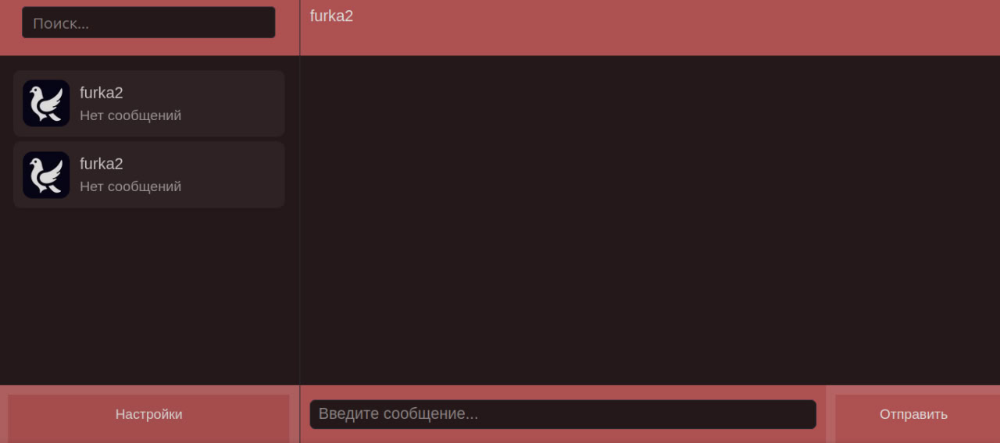
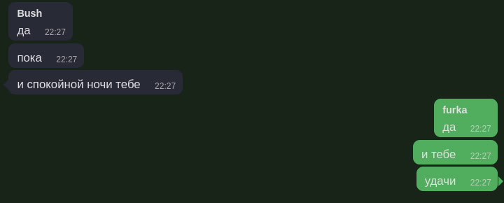
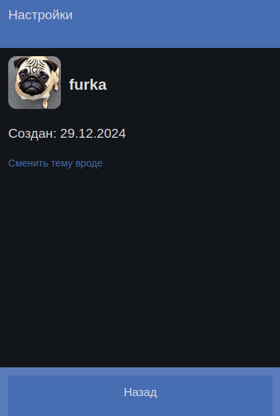

# 🕊 Pigeon Web — клиент для мессенджера Pigeon  

**Веб-интерфейс** для обмена сообщениями через **Pigeon Server**

 

*Пример интерфейса*  

## 🛠 Технологии  
- **Frontend**: HTML, CSS, Vanilla JS (без фреймворков)  
- **Backend**: Pigeon Server (закрытый исходный код)
- **Протокол**: WebSocket + REST API.  

## 🤝 Участие  
Pigeon Web — **открытый фронтенд**, и ты можешь:  
- 🐞 Сообщить о багах в **Issues**.  
- 💡 Предложить улучшения интерфейса.  
- ✨ Разработать новые фичи для клиента.  

*Бэкенд (Pigeon Server) закрыт, но клиент можно дорабатывать независимо.*  

**Лицензия**: 

*См. также*: [человекочитаемое резюме](LICENSE.md) (не является юридическим документом)

**Статус**: 

| Скриншот чата | Настройки |  
|---------------|----------|  
|  |  | 
